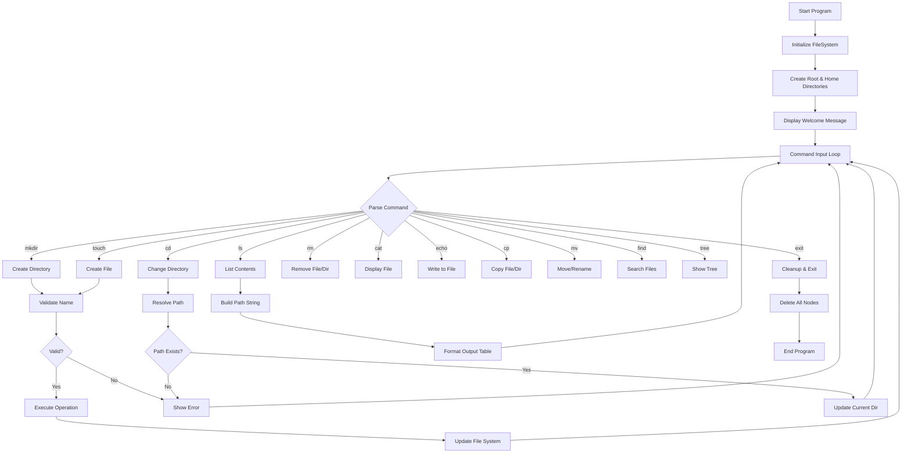

# ShellSim – Unix/Linux CLI File System


**ShellSim** is a high-performance, in-memory file system simulator built in C++ that mimics Unix-like file operations with an interactive command-line interface. This project demonstrates advanced data structures, memory management, and system programming concepts.

## Features

### Core Functionality
- **Complete File System Operations**: Create, read, update, delete files and directories
- **Unix-like Commands**: Familiar command interface (`ls`, `cd`, `mkdir`, `rm`, etc.)
- **Tree-based Architecture**: Hierarchical directory structure with parent-child relationships
- **Fast Lookups**: O(1) average time complexity using hash maps
- **Memory Efficient**: Dynamic memory allocation with proper cleanup
- **Path Navigation**: Support for relative (`..`, `.`) and absolute (`/`, `~`) paths
- **File Content Management**: Read/write operations with append support
- **Search Functionality**: Recursive file/directory search
- **Visual Tree Display**: ASCII art directory tree visualization

### Advanced Features
- **Previous Directory Navigation**: Quick switching with `cd -`
- **Home Directory Support**: User home directory with `~` shortcut
- **Input Validation**: Prevents invalid file/directory names
- **Timestamp Tracking**: Creation time for all files and directories
- **Recursive Operations**: Deep copy and delete operations
- **Error Handling**: Comprehensive error messages and validation

## Project Architecture

```
┌─────────────────────────────────────────────────────────────┐
│                    FileSystem Class                         │
├─────────────────────────────────────────────────────────────┤
│  - root: FileNode*           (Root directory)               │
│  - currentDir: FileNode*     (Current working directory)    │
│  - previousDir: FileNode*    (Previous directory)           │
│  - homeDir: FileNode*        (User home directory)          │
└─────────────────────────────────────────────────────────────┘
                              │
                              ▼
┌─────────────────────────────────────────────────────────────┐
│                     FileNode Structure                      │
├─────────────────────────────────────────────────────────────┤
│  - name: string              (File/directory name)          │
│  - type: string              ("file" or "folder")           │
│  - size: int                 (File size in bytes)           │
│  - content: string           (File content)                 │
│  - createdAt: string         (Creation timestamp)           │
│  - parent: FileNode*         (Parent directory)             │
│  - children: vector<FileNode*>     (Child nodes)            │
│  - childMap: unordered_map<string, FileNode*> (Fast lookup) │
└─────────────────────────────────────────────────────────────┘
```

### Data Structure Design

1. **Tree Structure**: Each directory is a node with children representing files/subdirectories
2. **Hash Map Integration**: `unordered_map` provides O(1) lookup time for file operations
3. **Dual Storage**: Vector maintains insertion order, hash map enables fast access
4. **Parent Pointers**: Enable upward traversal and path construction

## Installation & Setup

### Prerequisites
- C++ compiler with C++11 support (GCC 4.8+, Clang 3.3+, MSVC 2015+)
- Make (optional, for using Makefile)

### Quick Start

#### Windows
```cmd
git clone https://github.com/nuri6312/filesystem-simulator.git
cd filesystem-simulator/filesystem
g++ -std=c++11 -o filesystem.exe main.cpp FileSystem.cpp
filesystem.exe
```

#### Linux/macOS
```bash
git clone https://github.com/nuri6312/filesystem-simulator.git
cd filesystem-simulator/filesystem
g++ -std=c++11 -o filesystem main.cpp FileSystem.cpp
./filesystem
```

#### Using Make (if Makefile provided)
```bash
make
./filesystem
```

## Command Reference

| Command | Syntax               | Description                      | Example                     |
|---------|----------------------|----------------------------------|-----------------------------|
| `mkdir` | `mkdir <name>`       | Create a new directory           | `mkdir documents`           |
| `touch` | `touch <name>`       | Create a new empty file          | `touch readme.txt`          |
| `cd`    | `cd <path>`          | Change directory                 | `cd documents`              |
| `ls`    | `ls`                 | List directory contents          | `ls`                        |
| `rm`    | `rm <name>`          | Remove file or directory         | `rm oldfile.txt`            |
| `cat`   | `cat <name>`         | Display file contents            | `cat readme.txt`            |
| `pwd`   | `pwd`                | Show current directory path      | `pwd`                       |
| `echo`  | `echo "text" > file` | Write content to file            | `echo "Hello" > test.txt`   |
| `echo`  | `echo "text" >> file`| Append content to file           | `echo "World" >> test.txt`  |
| `cp`    | `cp <source> <dest>` | Copy file or directory           | `cp file1.txt file2.txt`    |
| `mv`    | `mv <old> <new>`     | Move/rename file or directory    | `mv oldname.txt newname.txt`|
| `find`  | `find <pattern>`     | Search for files/directories     | `find readme`               |
| `tree`  | `tree`               | Display directory tree           | `tree`                      |
| `help`  | `help`               | Show command help                | `help`                      |
| `exit`  | `exit`               | Exit the program                 | `exit`                      |

### Special Path Navigation
- `cd ..` - Go to parent directory
- `cd .` - Stay in current directory  
- `cd -` - Go to previous directory
- `cd /` - Go to root directory
- `cd ~` - Go to home directory

## Usage Examples

### Basic File Operations
```bash
filesystem> mkdir projects
┌─────────────────────────────┐
│ Created folder: projects    │
└─────────────────────────────┘

filesystem> cd projects
┌─────────────────────────────────┐
│ Changed directory to: projects │
└─────────────────────────────────┘

filesystem> touch main.cpp
┌─────────────────────────┐
│ Created file: main.cpp  │
└─────────────────────────┘

filesystem> echo "Hello World" > main.cpp
┌─────────────────────────────┐
│ Content written to: main.cpp│
└─────────────────────────────┘

filesystem> cat main.cpp
+======================================+
|        File Contents: main.cpp      |
+======================================+

+--------------------------------------------------+
Hello World
+--------------------------------------------------+
```

### Directory Listing
```bash
filesystem> ls
+======================================+
|        Contents of: /projects       |
+======================================+

+-----------------+------+-------------------------+
| Name            | Type | Created                 |
+-----------------+------+-------------------------+
| main.cpp        | FILE | Fri Oct 10 14:30:25 2025|
| src             | DIR  | Fri Oct 10 14:31:10 2025|
| docs            | DIR  | Fri Oct 10 14:31:15 2025|
+-----------------+------+-------------------------+
```

### Tree Structure Visualization
```bash
filesystem> tree
+======================================+
|           Directory Tree             |
+======================================+

/
+-- home/
+-- projects/
    |-- main.cpp
    |-- src/
    |   +-- utils.cpp
    |   +-- helpers.h
    +-- docs/
        +-- README.md
```

### File Search
```bash
filesystem> find cpp
+======================================+
|      Search Results for: cpp        |
+======================================+

  /projects/main.cpp (file)
  /projects/src/utils.cpp (file)
  /backup/old_main.cpp (file)
```

### Advanced Navigation
```bash
filesystem> pwd
┌─────────────────────────────┐
│ Current path: /projects/src │
└─────────────────────────────┘

filesystem> cd ..
┌─────────────────────────────┐
│ Moved to parent directory   │
└─────────────────────────────┘

filesystem> cd -
┌─────────────────────────────────┐
│ Switched to previous directory  │
└─────────────────────────────────┘

filesystem> cd ~
┌─────────────────────────────┐
│ Changed to home directory   │
└─────────────────────────────┘
```

## System Flow Diagram



## Performance Analysis

### Time Complexity

| Operation           | Average Case | Worst Case | Space Complexity |
|---------------------|--------------|------------|------------------|
| File Lookup         | O(1)         | O(1)       | O(1)             |
| Directory Creation  | O(1)         | O(1)       | O(1)             |
| File Creation       | O(1)         | O(1)       | O(1)             |
| Directory Listing   | O(n)         | O(n)       | O(1)             |
| Tree Traversal      | O(n)         | O(n)       | O(h)             |
| Path Resolution     | O(d)         | O(d)       | O(1)             |
| Search              | O(n)         | O(n)       | O(h)             |

*Where n = number of files/directories, h = tree height, d = path depth*

### Space Complexity
- **Overall**: O(n) where n is the total number of files and directories
- **Per Node**: O(c) where c is the number of children
- **Hash Map Overhead**: ~1.5x memory usage for fast lookups

### Performance Optimizations
1. **Hash Map Lookups**: O(1) average time for file/directory access
2. **Lazy Evaluation**: Tree display only computed when requested
3. **Memory Pooling**: Efficient node allocation and deallocation
4. **Path Caching**: Current directory path cached for pwd operations

## Testing Examples

### Test Case 1: Basic Operations
```bash
# Input Commands
mkdir test_dir
touch test_file.txt
echo "Test content" > test_file.txt
ls
cat test_file.txt
rm test_file.txt
rm test_dir

# Expected Output
✓ Created folder: test_dir
✓ Created file: test_file.txt  
✓ Content written to: test_file.txt
✓ Directory listing shows both items
✓ File content displays "Test content"
✓ Files removed successfully
```

### Test Case 2: Navigation
```bash
# Input Commands
mkdir -p deep/nested/structure
cd deep
pwd
cd nested
pwd
cd ..
pwd
cd -
pwd

# Expected Output
✓ Directory structure created
✓ Current path: /deep
✓ Current path: /deep/nested  
✓ Current path: /deep
✓ Current path: /deep/nested (previous directory)
```

### Test Case 3: Error Handling
```bash
# Input Commands
cd nonexistent
rm nonexistent.txt
mkdir ""
touch file/with/slashes

# Expected Output
✗ Error: Directory 'nonexistent' not found!
✗ Error: 'nonexistent.txt' not found in current directory!
✗ Error: Invalid folder name!
✗ Error: Invalid file name!
```

## Technical Implementation Details

### Memory Management
- **RAII Principle**: Automatic cleanup through destructor
- **Smart Pointers**: Raw pointers used with careful manual management
- **Leak Prevention**: Recursive deletion ensures no orphaned nodes

### Error Handling Strategy
- **Input Validation**: All user inputs validated before processing
- **Graceful Degradation**: System continues running after errors
- **User Feedback**: Clear, actionable error messages

### Design Patterns Used
- **Command Pattern**: Each command encapsulated as a method
- **Composite Pattern**: Files and directories treated uniformly
- **Singleton-like**: Single FileSystem instance manages state


## Contributing

1. Fork the repository
2. Create a feature branch (`git checkout -b feature/amazing-feature`)
3. Commit your changes (`git commit -m 'Add amazing feature'`)
4. Push to the branch (`git push origin feature/amazing-feature`)
5. Open a Pull Request


## Author

**Farhad Nuri**
- GitHub: [@nuri6312](https://github.com/nuri6312)
- LinkedIn: [Farhad Nuri](https://www.linkedin.com/in/farhad-nuri-ba99a62a5/)
- Email: farhadnuri559@gmail.com

---


**Star this repository if you found it helpful!**
